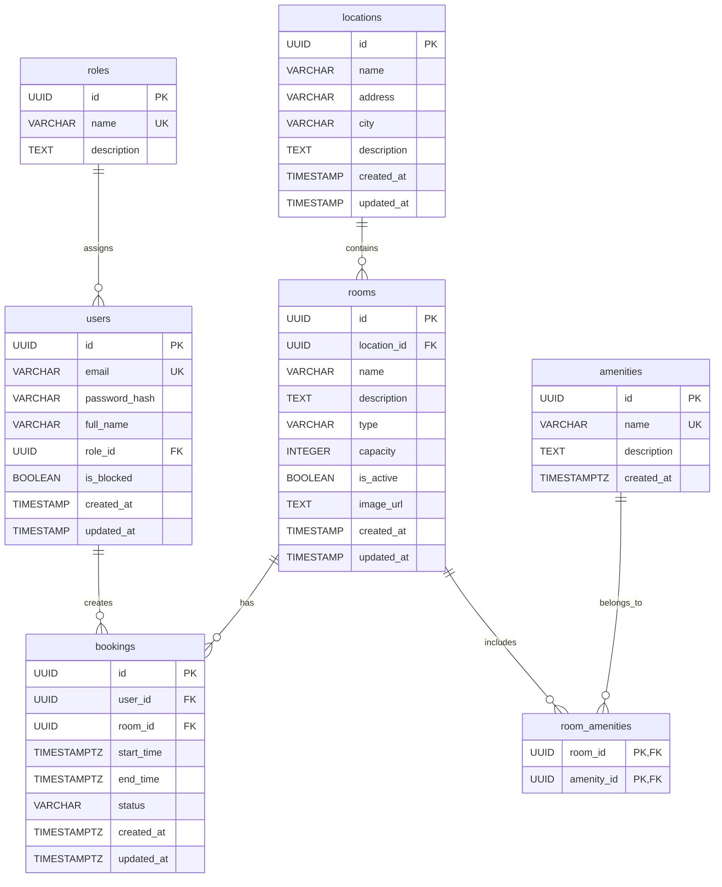

# ER-диаграмма базы данных

```mermaid
erDiagram
    roles ||--o{ users : assigns
    locations ||--o{ rooms : contains
    users ||--o{ bookings : creates
    rooms ||--o{ bookings : has
    rooms ||--o{ room_amenities : includes
    amenities ||--o{ room_amenities : belongs_to

    roles {
        UUID id PK
        VARCHAR name UK
        TEXT description
    }

    users {
        UUID id PK
        VARCHAR email UK
        VARCHAR password_hash
        VARCHAR full_name
        UUID role_id FK
        BOOLEAN is_blocked
        TIMESTAMP created_at
        TIMESTAMP updated_at
    }

    locations {
        UUID id PK
        VARCHAR name
        VARCHAR address
        VARCHAR city
        TEXT description
        TIMESTAMP created_at
        TIMESTAMP updated_at
    }

    rooms {
        UUID id PK
        UUID location_id FK
        VARCHAR name
        TEXT description
        VARCHAR type
        INTEGER capacity
        BOOLEAN is_active
        TEXT image_url
        TIMESTAMP created_at
        TIMESTAMP updated_at
    }

    bookings {
        UUID id PK
        UUID user_id FK
        UUID room_id FK
        TIMESTAMPTZ start_time
        TIMESTAMPTZ end_time
        VARCHAR status
        TIMESTAMPTZ created_at
        TIMESTAMPTZ updated_at
    }

    amenities {
        UUID id PK
        VARCHAR name UK
        TEXT description
        TIMESTAMPTZ created_at
    }

    room_amenities {
        UUID room_id PK, FK
        UUID amenity_id PK, FK
    }
```
